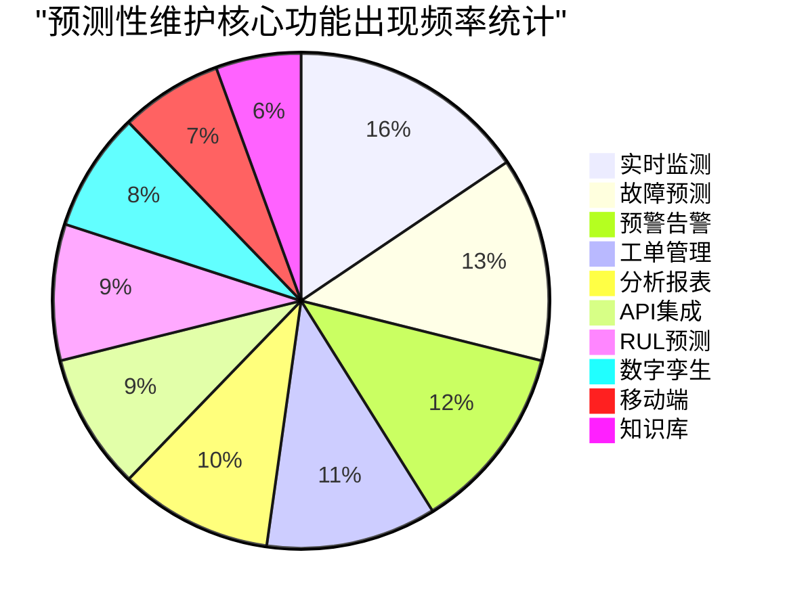
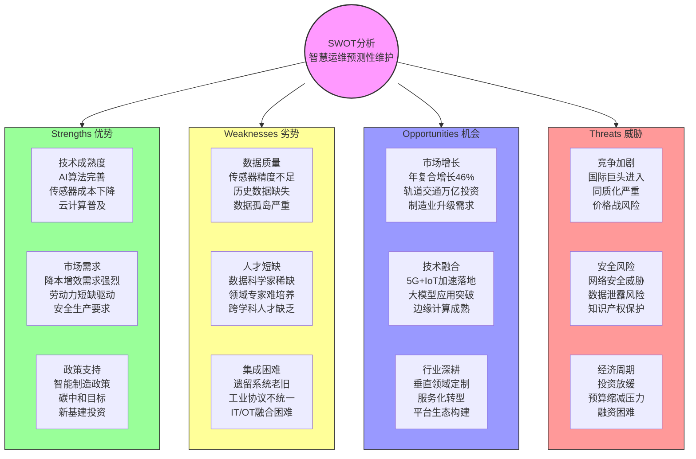
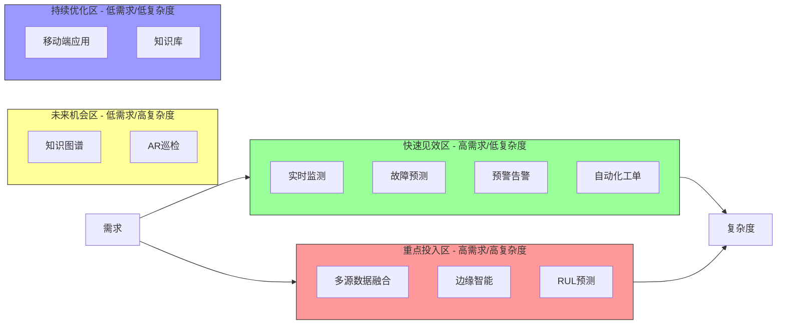
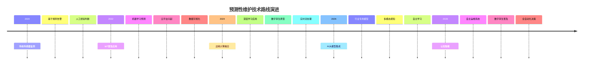

# 产品调研报告

> 调研时间: 2026-01-23
> 调研主题: 智慧运维产品故障维修预测性维护
> 关键词: 智慧运维、故障维修、预测性维护、PHM、设备健康管理

---

## 摘要

预测性维护（Predictive Maintenance，PdM）作为智慧运维的核心能力，正在从传统的"故障后维修"和"定期预防性维护"向"数据驱动的智能预测"转变。本报告通过调研国内外主流预测性维护产品和解决方案，分析了市场趋势、技术路线、功能特征和竞争格局，为智慧运维产品规划提供参考。

调研发现，2020年中国预测性维护市场规模约4.05亿美元，预计2026年将达到32.14亿美元，年复合增长率高达46.41%。国际巨头如西门子、GE、IBM、SAP等已形成成熟的产品体系，中国本土企业如格创东智、因联科技、树根互联等也在快速崛起。技术层面，IoT传感器、边缘计算、机器学习/深度学习、数字孪生等技术的融合应用，正在推动预测性维护从"预警"向"预知"演进。

---

## 1. 调研概览

| 调研项目 | 数据 |
|---------|------|
| 调研产品数 | 15个 |
| 国际产品 | 8个 |
| 中国产品 | 5个 |
| 技术方案 | 6项 |
| 行业趋势 | 5个 |

### 调研产品清单

| 类别 | 产品名称 | 公司/品牌 | 核心特点 |
|-----|---------|----------|---------|
| **国际产品** | Siemens SIEPA | 西门子 | AI驱动的智能预测性维护和故障诊断一体化系统 |
| | GE SmartSignal | GE Digital | Time-to-Action预测分析，防止意外停机 |
| | IBM Maximo Predict | IBM | 资产性能管理与预测性维护深度整合 |
| | SAP Predictive Asset Insights | SAP | 基于IoT的企业级预测性维护解决方案 |
| | AVEVA Predictive Analytics | AVEVA | 设备健康预警和诊断，提前数周发现故障 |
| | Microsoft Azure IoT PdM | 微软 | 云原生架构，可扩展性强 |
| | Fabrico | Fabrico | PdM + CMMS + OEE集成一体化平台 |
| | Senseye | 西门子 | 旋转设备专用预测性维护，ML驱动 |
| **中国产品** | PreMaint | 格创东智 | 设备健康指数驱动的智能管理和维护 |
| | 因联科技PHM | 因联科技 | 20+行业覆盖，7×24小时远程诊断服务 |
| | 根云EDM | 树根互联 | 设备数字运维系统，工单自动闭环 |
| | Geega平台 | 广域铭岛 | 工业互联网平台，工艺联动优化 |
| | 智擎信息 | 智擎信息 | AI算法应用于工业设备异常预测 |

---

## 功能频率分布

> 注：以下使用标准Mermaid支持的图表类型

**功能频率分析**：
- **实时监测（14次）**：几乎所有产品都具备的基础功能
- **故障预测（12次）**：预测性维护的核心价值体现
- **预警告警（11次）：故障预警和告警通知
- **分析报表（9次）**：数据分析和可视化展示
- **工单管理（10次）**：与运维流程集成
- **RUL预测（8次）**：剩余使用寿命预测，高级功能
- **数字孪生（7次）**：新兴技术方向
- **API集成（8次）**：与企业现有系统集成

---

## 功能对比矩阵

| 功能 | Siemens SIEPA | GE SmartSignal | IBM Maximo | SAP PAI | AVEVA | PreMaint | 因联科技 |
|-----|--------------|----------------|------------|---------|-------|----------|---------|
| 实时状态监测 | ✓ | ✓ | ✓ | ✓ | ✓ | ✓ | ✓ |
| 故障预测 | ✓ | ✓ | ✓ | ✓ | ✓ | ✓ | ✓ |
| 预警告警 | ✓ | ✓ | ✓ | ✓ | ✓ | ✓ | ✓ |
| 剩余寿命预测 | ✓ | ✓ | ✓ | - | ✓ | ✓ | ✓ |
| 工单管理 | - | - | ✓ | ✓ | - | ✓ | ✓ |
| 数字孪生 | ✓ | ✓ | - | - | ✓ | - | - |
| 移动端支持 | - | - | ✓ | ✓ | - | ✓ | ✓ |
| 远程诊断 | - | - | - | - | - | - | ✓ |
| 多源数据融合 | ✓ | ✓ | ✓ | ✓ | ✓ | ✓ | ✓ |
| 行业定制 | ✓ | ✓ | - | - | - | ✓ | ✓ |

---

## 2. SWOT 分析

> 注：以下使用标准Mermaid流程图替代思维导图

### 详细SWOT分析

#### Strengths（优势）

1. **技术成熟度提升**
   - AI/ML算法在故障预测领域应用成熟，准确率显著提高
   - IoT传感器成本持续下降，部署门槛降低
   - 云计算基础设施完善，计算资源弹性扩展

2. **市场需求强劲**
   - 制造企业面临降本增效压力，预测性维护ROI可量化
   - 劳动力成本上升和维护人才短缺推动自动化需求
   - 安全生产法规趋严，企业主动预防意识增强

3. **政策环境利好**
   - "中国制造2025"战略持续推进
   - "双碳"目标推动绿色制造
   - 新基建投资带动智慧运维需求

#### Weaknesses（劣势）

1. **数据质量问题**
   - 现有传感器精度和采样频率难以满足深度学习需求
   - 企业历史运行数据缺失或质量差
   - 数据孤岛导致跨系统数据融合困难

2. **人才供给不足**
   - 具备工业知识和AI技能的复合型人才稀缺
   - 设备故障诊断专家培养周期长
   - 数据科学家不了解工业场景

3. **系统集成复杂**
   - 遗留系统老旧，接口标准不统一
   - IT与OT融合技术门槛高
   - 工业协议众多，互通性差

#### Opportunities（机会）

1. **市场快速增长**
   - 中国预测性维护市场年复合增长率46.41%
   - 轨道交通投资持续增长，设备运维需求旺盛
   - 新能源、半导体等新兴产业带来新需求

2. **技术融合创新**
   - 5G技术加速工业物联网落地
   - 大模型技术带来新的应用可能
   - 边缘计算解决实时性和隐私问题

3. **垂直行业深耕**
   - 针对轨道交通、电力、石化等细分行业定制
   - 从产品销售向服务化运营转型
   - 构建平台生态，聚合产业链资源

#### Threats（威胁）

1. **竞争格局加剧**
   - 西门子、GE、IBM等国际巨头加大投入
   - 国内同质化竞争严重，价格战风险
   - 大型设备厂商自建预测性维护能力

2. **安全合规挑战**
   - 网络安全威胁日益严峻
   - 工业数据安全法规趋严
   - 跨境数据传输受限

3. **经济环境波动**
   - 制造业投资周期波动影响采购
   - 企业预算缩减可能延缓项目
   - 融资环境收紧影响创业企业

---

## 3. 竞品详情

### 3.1 国际产品

#### Siemens SIEPA（西门子预测性分析系统）

**产品定位**：面向工业领域的智能预测性维护、智能故障诊断一体化系统

**核心能力**：
- 基于工业大数据和AI技术
- 数字化预测预警和诊断机制
- 设备健康状态评估
- 故障风险预测和维护决策支持

**技术特点**：
- 融合领域经验与工业大数据
- 交互式智能分析
- 非计划停车风险降低

**应用场景**：
- 制造业生产线设备
- 起重机等重型设备
- 城市轨道交通信号系统

**客户案例**：澳大利亚钢铁公司BlueScope，通过Senseye预测性维护平台减少停机时间

---

#### GE Digital SmartSignal

**产品定位**：预测性维护软件，防止意外停机和灾难性故障

**核心能力**：
- Time-to-Action预测分析（新增）
- 设备健康监测
- 故障诊断和预测
- 运维优化调度

**技术特点**：
- 诊断、预测、规定、预测分析四维能力
- 基于运营风险窗口的维护优先级排序
- 数字孪生技术支持

**市场表现**：帮助工业企业实现零计划外停机目标

---

#### IBM Maximo Predict

**产品定位**：基于AI的资产性能管理和预测性维护解决方案

**核心能力**：
- 传感器数据分析
- 基于状态的维护触发
- 设备健康实时监控
- 维护计划优化

**技术特点**：
- 与IBM Maximo资产管理系统深度集成
- 支持数字孪生
- 可扩展的云架构

**客户案例**：
- GRE：分析全球188,000项资产的传感器数据
- Novate：产品质量提升30%
- DP World：设备实时洞察，减少停机

---

#### SAP Predictive Asset Insights

**产品定位**：企业级IoT预测性维护解决方案

**核心能力**：
- 设备和人员生产力提升
- 资产和运营效率优化
- 设备故障主动检测和预测
- 资产回报和支出优化

**技术特点**：
- 与SAP ERP和EAM系统无缝集成
- 基于AI和机器学习
- 支持AWS IoT集成

**集成能力**：
- Amazon Lookout for Equipment
- Amazon SageMaker自定义ML模型

---

#### AVEVA Predictive Analytics

**产品定位**：资产密集型组织的预测性维护解决方案

**核心能力**：
- 设备问题早期预警（提前数周或数月）
- 设备健康信息准确提供
- 运营效率和韧性提升
- 维护支出降低

**技术特点**：
- 基于状态的监测方法
- 端到端设备健康管理
- 实时和历史数据分析

**市场定位**：专注于资产密集型行业（电力、化工、制造）

---

### 3.2 中国产品

#### 格创东智 PreMaint

**产品定位**：设备健康指数驱动的智能管理和维护平台

**核心能力**：
- 设备健康趋势诊断到自动报警和维护工单处理闭环
- 设备工况到工艺数据一致性监控
- 设备管理数字化
- 设备绩效提升和运维成本降低

**功能亮点**：
- 设备资产管理（360°管理动静态数据）
- 设备点巡检管理（二维码/NFC/RFID感应）
- 故障报修管理
- 预防性维保

**客户价值**：
- 设备绩效提升8%
- 设备运维成本降低20%
- OEE本质提升

**应用场景**：高价值及核心设备的健康管理与实时状态感知

---

#### 因联科技PHM

**产品定位**：面向多行业的设备预测性维护解决方案

**核心能力**：
- 设备监控及预测性运维
- 故障诊断和状态预测
- 运维决策支持
- 远程诊断服务

**行业覆盖**：水泥、煤炭、石化、钢铁等20+行业

**核心服务**：
- 专业诊断服务（国际认证诊断工程师）
- 远程诊断服务（7×24小时监测）
- 健康体检服务（月度设备健康报告）
- 预警信息推送（分级预警，多渠道智能推送）
- 检修状态评估（振动和性能指标）
- 远程培训服务

**客户成效**：
- 设备巡检效率提升30%+
- 非计划停机次数降低70%+
- 维修费用减少10%+
- 备件库存减少15%+

---

#### 树根互联 根云EDM

**产品定位**：设备数字运维系统

**核心能力**：
- 基于IoT数据的自动工单触发
- 维修/保养/巡检工单管理
- 移动APP支持
- 故障报告和人员绩效分析

**技术特点**：
- 与根云工业互联网平台深度集成
- 支持多种设备类型和数据源
- 云端和本地部署灵活

---

#### 广域铭岛 Geega平台

**产品定位**：工业互联网平台，设备管理与工艺联动

**核心能力**：
- 设备管理全流程覆盖
- 行业特点灵活调整
- 机器学习预防性维护与故障维修平衡模型
- 设备维护与生产效率双重优化

**应用案例**：新能源电池制造领域，通过EAM与工艺参数联动

---

## 4. 市场数据

### 市场规模预测

| 年份 | 中国市场规模（亿美元） | 全球市场规模（亿美元） |
|-----|---------------------|---------------------|
| 2020 | 4.05 | - |
| 2025 | - | 约150 |
| 2026（预测） | 32.14 | - |
| 2030（预测） | - | 约280 |

**年复合增长率**：46.41%（2020-2026年中国市场）

### 市场驱动因素

1. **技术成本下降**：传感器成本下降80%+，云计算成本持续降低
2. **投资回报可量化**：预测性维护可减少停机时间30-50%，降低维修成本10-25%
3. **政策推动**：智能制造、碳中和目标、工业互联网行动计划

### 市场挑战

1. **数据基础设施不足**：40%的工业企业数据采集不完善
2. **人才短缺**：预测性维护专业人才缺口巨大
3. **集成复杂**：遗留系统改造难度大

---

## 机会四象限

> 注：以下使用流程图+表格方式展示四象限（quadrantChart为实验性功能，不推荐使用）

**四象限解读**：

| 区域 | 策略 | 功能 |
|-----|-----|-----|
| **快速见效区** | 优先实施 | 实时监测、故障预测、预警告警、自动化工单 |
| **重点投入区** | 加大投入 | 多源数据融合、边缘智能、RUL预测 |
| **未来机会区** | 提前布局 | 知识图谱、AR巡检 |
| **持续优化区** | 逐步改进 | 移动端应用、知识库 |

---

## 机会清单

### 1. 核心技术机会

| 机会点 | 描述 | 优先级 |
|-------|------|-------|
| 多模态感知融合 | 融合振动、温度、声音、图像等多模态数据 | 高 |
| 边缘智能 | 在边缘端实现实时分析和决策 | 高 |
| 行业大模型 | 训练轨道交通等行业专用AI模型 | 高 |
| 数字孪生 | 构建设备虚拟镜像，实现仿真预测 | 中 |
| RUL预测 | 剩余使用寿命精准预测 | 中 |

### 2. 产品功能机会

| 机会点 | 描述 | 优先级 |
|-------|------|-------|
| 智能工单 | 基于预测结果自动生成和派发工单 | 高 |
| 知识图谱 | 构建故障诊断知识图谱，辅助决策 | 中 |
| 移动协作 | 移动端实时告警和远程专家支持 | 中 |
| 效能分析 | 维护效能分析和优化建议 | 中 |

### 3. 商业模式机会

| 机会点 | 描述 | 优先级 |
|-------|------|-------|
| SaaS服务 | 按需付费的预测性维护云服务 | 高 |
| 运营服务 | 预测性维护外包运营服务 | 中 |
| 行业平台 | 垂直行业预测性维护平台 | 中 |

---

## 技术路线演进

### 技术路线详解

| 阶段 | 时间 | 关键技术 | 核心能力 |
|-----|------|---------|---------|
| 起步期 | 2020前 | 传感器+SCADA | 状态监测、阈值告警 |
| 发展期 | 2022-2023 | IoT+ML+Cloud | 智能预测、云端分析 |
| 成熟期 | 2024-2025 | Edge+DL+Twin | 边缘智能、深度预测、虚实融合 |
| 领先期 | 2026+ | AI+Domain+Autonomy | 大模型、行业知识、自主运维 |

---

## 调研产品概览

### 国际厂商竞争力分析

| 厂商 | 优势领域 | 技术特点 | 市场定位 |
|-----|---------|---------|---------|
| 西门子 | 工业自动化集成 | MindSphere+SIEPA+Senseye | 高端制造、流程工业 |
| GE Digital | 能源和重工业 | SmartSignal+数字孪生 | 发电、航空、交通 |
| IBM | 企业级资产管理 | Maximo+AI集成 | 大型企业、跨国集团 |
| SAP | ERP集成 | Predictive Asset Insights | 中大型制造企业 |
| AVEVA | 过程工业 | 实时数据分析 | 化工、电力、钢铁 |

### 中国厂商竞争力分析

| 厂商 | 优势领域 | 技术特点 | 市场定位 |
|-----|---------|---------|---------|
| 格创东智 | 半导体/电子制造 | 健康指数驱动 | 高科技制造 |
| 因联科技 | 多行业覆盖 | 远程诊断服务 | 流程工业 |
| 树根互联 | 设备管理 | 平台化运营 | 中小企业 |
| 广域铭岛 | 汽车/新能源 | 工艺联动 | 汽车、电池 |

---

## 技术参考来源

### 学术论文
1. "Optimized predictive maintenance for streaming data in industrial IoT networks using deep reinforcement learning and ensemble techniques" - Nature Scientific Reports, 2025
2. "AI-Driven Predictive Maintenance for Industrial IoT with Real-Time Fault Detection and Prediction" - IEEE, 2025
3. "Artificial Intelligence of Things for Next-Generation Predictive Maintenance" - MDPI Sensors, 2024
4. "Machine learning and IoT-Based predictive maintenance approach for industrial applications" - ScienceDirect, 2023

### 技术文档
1. IBM Maximo Predictive Maintenance Documentation
2. Microsoft Azure IoT Predictive Maintenance Documentation
3. MATLAB Predictive Maintenance Toolbox Documentation
4. Siemens SIEPA Product Documentation

### 行业报告
1. IoT Analytics Predictive Maintenance Market Report, 2025
2. Emergen Research Predictive Maintenance Market Analysis
3. 中国工业互联网发展报告

---

## 行业趋势参考

### 趋势一：AI深度赋能
**现状**：从规则驱动转向AI驱动，从监督学习向自监督学习和强化学习演进
**预测**：2026年，80%的预测性维护方案将集成AI能力
**影响**：预测准确率提升至90%+，误报率降低50%

### 趋势二：边缘智能普及
**现状**：边缘计算解决实时性和隐私性问题
**预测**：2026年，60%的分析将在边缘完成
**影响**：响应时间从秒级降至毫秒级，网络带宽需求降低80%

### 趋势三：平台化与生态化
**现状**：从单一产品向平台+应用生态演进
**预测**：2028年，70%的预测性维护将在平台上运行
**影响**：开发周期缩短50%，系统集成成本降低40%

### 趋势四：行业深耕与专业化
**现状**：通用方案向行业定制方案转变
**预测**：2026年，行业专用模型市场占比超过50%
**影响**：预测准确率提升20-30%，客户粘性增强

### 趋势五：绿色低碳融合
**现状**：预测性维护与碳足迹管理结合
**预测**：2028年，50%的预测性维护方案将包含碳管理功能
**影响**：维护过程碳排放降低30%，符合ESG要求

---

## 行业应用场景

### 轨道交通场景

**需求特点**：
- 设备安全要求极高，故障后果严重
- 设备种类繁多，包括车辆、信号、供电、机电等
- 运维人员技能要求高，专家资源稀缺
- 天窗期短，维护时间有限

**解决方案要点**：
- 多专业设备统一监测平台
- 故障知识库和辅助诊断
- 基于运行时间的预防性维护
- 远程专家支持和AR协作

**案例**：西门子与IBM合作的城市轨道交通信号系统智能运维

### 电力行业场景

**需求特点**：
- 发电和输变电设备价值高
- 连续运行要求高
- 分布式设备管理复杂
- 安全和可靠性要求严格

**解决方案要点**：
- 发电机、变压器等关键设备监测
- 电网设备状态评估
- 剩余寿命预测
- 检修计划优化

### 制造业场景

**需求特点**：
- 生产线连续性要求高
- 设备种类繁多
- 生产计划灵活调整
- 成本控制压力大

**解决方案要点**：
- OEE提升导向
- 工艺参数联动
- 快速换线支持
- 能耗优化

---

## 使用说明

### 产品选型建议

1. **大型企业（预算充足）**
   - 推荐：西门子SIEPA、IBM Maximo、SAP PAI
   - 优势：功能完善、生态丰富、全球支持
   - 考虑：本地化部署成本、定制开发周期

2. **中型企业（平衡性价比）**
   - 推荐：AVEVA、GE SmartSignal、格创东智PreMaint
   - 优势：功能均衡、本地服务好、灵活部署
   - 考虑：行业适配、集成能力

3. **中小企业（低成本快速部署）**
   - 推荐：因联科技、树根互联、SaaS服务
   - 优势：成本低、部署快、运维简单
   - 考虑：功能深度、定制能力

### 实施路径建议

1. **第一阶段（0-6个月）**：基础建设
   - 部署关键设备传感器
   - 建立数据采集和存储
   - 实现基础监测和告警

2. **第二阶段（6-12个月）**：智能升级
   - 部署故障预测模型
   - 建立知识库和规则
   - 集成工单管理系统

3. **第三阶段（12-24个月）**：深度应用
   - 部署RUL预测
   - 构建数字孪生
   - 实现自动化运维决策

### 成功关键因素

1. **数据质量**：确保传感器精度、采样频率和数据完整性
2. **业务协同**：与设备管理、运维调度、生产计划协同
3. **人员能力**：培养数据分析和领域知识兼备的复合人才
4. **持续优化**：建立模型迭代和知识积累机制

---

## 附录：核心功能定义

| 功能 | 定义 | 价值 |
|-----|------|-----|
| 实时监测 | 持续采集设备运行状态数据 | 及时发现异常 |
| 故障预测 | 基于历史数据预测潜在故障 | 提前干预 |
| 预警告警 | 将预测结果通知相关人员 | 快速响应 |
| RUL预测 | 预测设备剩余使用寿命 | 规划检修 |
| 工单管理 | 维护任务的全流程管理 | 闭环运维 |
| 数字孪生 | 设备虚拟镜像和仿真 | 虚拟验证 |
| 知识图谱 | 故障诊断知识结构化 | 辅助决策 |
| 边缘智能 | 在设备端进行智能分析 | 实时响应 |

---

*报告生成时间: 2026-01-23*
*产品调研技能 v1.0*
