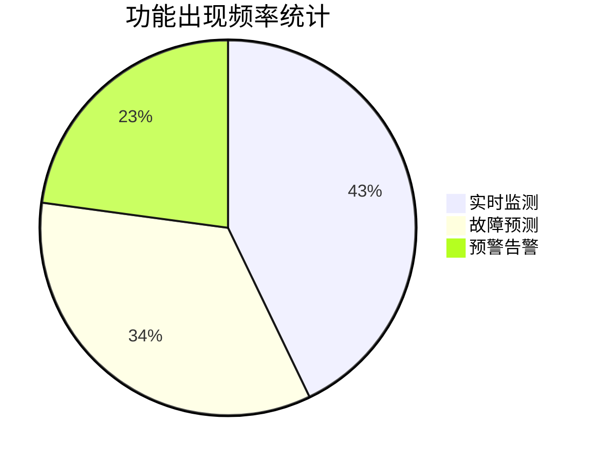
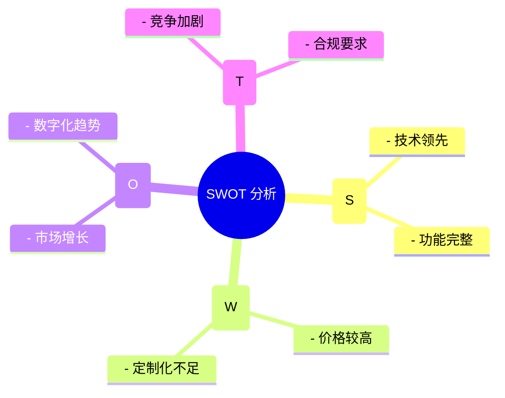

# Spec: Report Format

**Capability**: `report-format`

**Version**: 1.0.0

**Last Updated**: 2026-01-29

## Overview

Research reports are generated as Markdown files with embedded Mermaid diagrams. This format provides:
- Structured documentation
- Rich visualizations (Mermaid)
- Easy export/printing
- Direct frontend rendering

## File Naming

- **Path**: `task-data/{projectId}-report.md`
- **Example**: `task-data/proj_abc123-report.md`

## Document Structure

```
task-data/{projectId}-report.md
│
├── # Title (H1)
├── metadata blockquote
├── ## 摘要
├── ## 调研概览
├── ## 市场背景分析
├── ## 目标用户分析
├── ## 竞品分析
├── ## 功能分析
├── ## 技术分析
├── ## SWOT 分析
├── ## 商业模式分析
├── ## 市场机会分析
├── ## 技术路线演进
├── ## 风险分析
├── ## 战略建议
├── ## 数据来源说明
└── ## 附录
```

## Required Sections

### Title Block

```markdown
# 产品调研报告标题

> 调研时间: 2026-01-29
> 调研主题: 预测性维护产品调研
> 关键词: AI, IoT, 预测性维护
```

### 摘要 (Abstract)

```markdown
## 摘要

本报告通过调研全网产品信息，为您提供详细的{产品名称}分析和机会洞察。基于对{搜索结果数量}条搜索结果的深度分析，我们识别出{功能数}个核心功能类别、{竞品数}个主要竞品，并给出了SWOT分析、市场机会和技术路线建议。
```

### 调研概览 (Overview)

```markdown
## 1. 调研概览

| 项目 | 数据 |
|-----|------|
| 调研产品数 | 25 |
| 数据来源 | DuckDuckGo, RSS, Dev.to |
| 关键词 | 预测性维护, AI, IoT |
| 识别功能数 | 12 |
| 识别竞品数 | 8 |
```

### 市场背景分析 (Market Analysis)

```markdown
## 2. 市场背景分析

### 2.1 市场规模与趋势

| 指标 | 数据 |
|-----|------|
| 市场规模 | 百亿级 |
| 年增长率 | 15-20% |
| 主要玩家 | 厂商A, 厂商B, 厂商C |

### 2.2 市场趋势

1. **AI 与 IoT 深度融合**
2. **边缘计算普及应用**
3. **行业定制化需求增长**
```

### 竞品分析 (Competitor Analysis)

```markdown
## 4. 竞品分析

### 4.1 竞品总览

| 竞品名称 | 行业 | 核心功能 | 描述 |
|---------|------|---------|------|
| 产品A | 制造业 | 实时监测, 故障预测 | 完整解决方案 |
| 产品B | 能源行业 | AI分析, 预警告警 | 专注细分领域 |
```

### 功能分析 (Feature Analysis)

```markdown
## 5. 功能分析

### 5.1 核心功能列表

| 功能 | 出现次数 | 占比 | 数据来源 |
|-----|---------|------|---------|
| 实时监测 | 15 | 85% | DuckDuckGo, RSS |
| 故障预测 | 12 | 68% | Dev.to, Reddit |

### 5.2 功能频率分布图


```

### SWOT 分析 (SWOT Analysis)

```markdown
## 7. SWOT 分析

### 7.1 优势 (Strengths)

- 整合实时监测、故障预测等核心功能
- 多数据源实时采集能力
- AI驱动的智能分析引擎

### 7.2 劣势 (Weaknesses)

- 行业定制化能力有待加强
- 复杂场景下的准确率需要提升

### 7.3 机会 (Opportunities)

- 预测性维护市场快速增长
- 制造业数字化转型需求旺盛

### 7.4 威胁 (Threats)

- 国际厂商的技术竞争
- 数据安全和隐私合规要求

### 7.5 SWOT 思维导图


```

### 战略建议 (Recommendations)

```markdown
## 12. 战略建议

### 12.1 短期行动（0-3个月）

1. 确定核心目标市场和用户画像
2. 完成MVP产品开发和验证
3. 建立种子用户群体

### 12.2 中期规划（3-12个月）

1. 扩展功能覆盖，发布正式版本
2. 建立销售和渠道体系
3. 获得首批付费客户

### 12.3 长期愿景（1-3年）

1. 成为细分领域领先供应商
2. 建立开放生态系统
3. 探索国际化机会
```

### 数据来源说明 (Data Sources)

```markdown
## 18. 数据来源说明

本报告数据来源于以下渠道：

- **RSS 订阅**：Hacker News, TechCrunch, The Verge, Wired, Product Hunt
- **搜索引擎**：DuckDuckGo
- **技术社区**：Dev.to, Reddit, V2EX
```

### 附录 (Appendix)

```markdown
## 19. 附录

### 19.1 功能详细数据表

| 功能 | 出现次数 | 占比 | 包含关键词 |
|-----|---------|------|-----------|
| 实时监测 | 15 | 85% | DuckDuckGo, RSS |

### 19.2 竞品详细信息

- **产品A**: [描述] (来源: https://a.com)

### 19.3 调研方法论

本报告采用以下调研方法：
1. **信息收集**：通过多渠道收集产品相关信息
2. **数据分析**：使用规则引擎进行功能、竞品、市场分析
3. **可视化呈现**：通过Mermaid图表展示分析结果
```

## Mermaid 图表类型

| 图表类型 | 用途 | 示例 ID |
|---------|------|---------|
| pie | 功能频率分布 | feature-frequency |
| mindmap | SWOT 思维导图 | swot-mindmap |
| timeline | 技术路线演进 | tech-timeline |
| journey | 用户旅程图 | user-journey |
| radar | 竞品能力对比 | competitor-radar |
| graph | 系统架构图 | architecture-diagram |
| quadrant | 机会四象限 | opportunity-quadrant |
| stateDiagram | 状态流转 | state-diagram |

## Report Generation Template

```typescript
interface ReportTemplate {
  sections: ReportSection[];
  mermaidCharts: MermaidChartConfig[];
  metadata: ReportMetadata;
}

const REPORT_TEMPLATE: ReportTemplate = {
  sections: [
    { id: 'abstract', title: '摘要', required: true },
    { id: 'overview', title: '调研概览', required: true },
    { id: 'market', title: '市场背景分析', required: true },
    { id: 'users', title: '目标用户分析', required: false },
    { id: 'competitors', title: '竞品分析', required: true },
    { id: 'features', title: '功能分析', required: true },
    { id: 'technology', title: '技术分析', required: false },
    { id: 'swot', title: 'SWOT 分析', required: true },
    { id: 'business', title: '商业模式分析', required: false },
    { id: 'opportunities', title: '市场机会分析', required: true },
    { id: 'roadmap', title: '技术路线演进', required: false },
    { id: 'risks', title: '风险分析', required: true },
    { id: 'recommendations', title: '战略建议', required: true },
    { id: 'sources', title: '数据来源说明', required: true },
    { id: 'appendix', title: '附录', required: false },
  ],
  mermaidCharts: [
    { id: 'feature-frequency', type: 'pie', required: true },
    { id: 'swot-mindmap', type: 'mindmap', required: true },
    { id: 'tech-timeline', type: 'timeline', required: false },
  ],
  metadata: {
    templateVersion: '1.0.0',
    generatedAt: new Date().toISOString(),
  },
};
```

## Frontmatter for Reports

```yaml
---
reportId: string           # 报告 ID
projectId: string          # 关联项目 ID
title: string              # 报告标题
generatedAt: string        # 生成时间
generator: string          # 生成器版本
keywords: string[]         # 关键词
summary: string            # 摘要预览
---
```

## ADDED Requirements

### Requirement: Report Title Block

The report SHALL start with a title block.

#### Scenario: Title block format
- **WHEN** the report is generated
- **THEN** it SHALL start with `# {Report Title}` (H1)
- **AND** followed by a metadata blockquote with: 调研时间, 调研主题, 关键词

### Requirement: Required Report Sections

The report SHALL include specific sections.

#### Scenario: Required sections present
- **WHEN** the report is generated
- **THEN** it SHALL include: 摘要, 调研概览, 竞品分析, 功能分析, SWOT 分析, 战略建议, 数据来源说明
- **AND** optional sections MAY include: 市场背景分析, 目标用户分析, 技术分析, 商业模式分析, 市场机会分析, 技术路线演进, 风险分析, 附录

### Requirement: Mermaid Diagrams

Analysis visualizations SHALL use Mermaid syntax.

#### Scenario: Mermaid diagrams embedded
- **WHEN** charts are generated
- **THEN** they SHALL be enclosed in mermaid code blocks
- **AND** supported chart types include: pie, mindmap, timeline, radar, graph, quadrant, journey, stateDiagram

### Requirement: Data Tables

Data SHALL be presented in Markdown tables.

#### Scenario: Data in tables
- **WHEN** numerical data is presented
- **THEN** it SHALL be formatted as Markdown tables
- **AND** tables SHALL have descriptive headers
- **AND** columns SHALL be aligned properly
